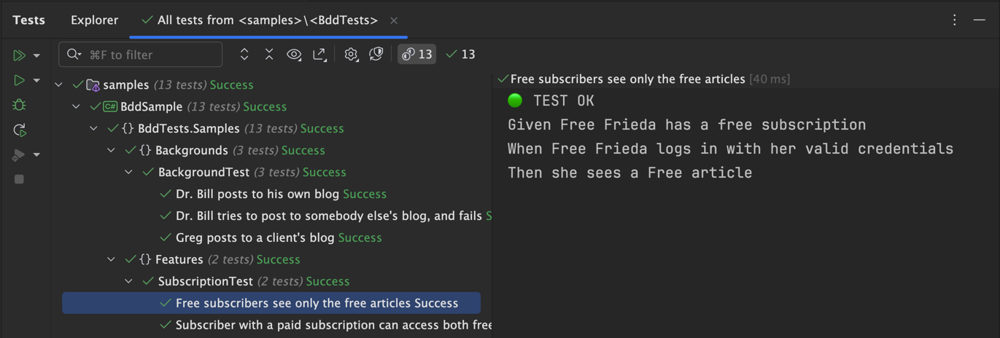

# 🚀 GherXUnit: An Alternative for BDD with xUnit
[🇧🇷 Versão em Português](README_PTBR.md) | [🇬🇧 English Version](README.md)

The adoption of Behavior-Driven Development (BDD) has become increasingly common in software development, promoting better communication between technical and non-technical teams. However, its integration with traditional testing frameworks is not always straightforward.

GherXUnit emerges as a viable alternative for teams looking to explore the benefits of BDD within the xUnit framework, without requiring external tools such as Cucumber or SpecFlow.

> [!IMPORTANT]  
> According to the study *Behavior Driven Development: A Systematic Literature Review* (Farooq et al., 2023, IEEE Access), some recurring difficulties in using BDD include:
> - **Complex automation**: Integration with external tools can increase configuration and test execution complexity.
> - **Difficult maintenance**: As the test base grows, Gherkin scenarios can become hard to manage.
> - **Learning curve**: The need to master new tools can hinder BDD adoption, especially in teams already familiar with traditional frameworks.

### ✅ Where Can GherXUnit Help?

GherXUnit aims to offer an alternative for teams already using xUnit and looking to incorporate the BDD structure without completely changing their tools. Among its benefits are:

- ✔ **Using Gherkin syntax directly in xUnit**, reducing external dependencies.
- ✔ **More modular and organized code**, using partial classes to separate scenarios and steps.
- ✔ **Better integration with unit tests**, allowing a smoother transition between different levels of testing.

### 💡 How Does It Work?

The core idea of GherXUnit is to allow test scenarios to be written in a structure familiar to those already using xUnit.

#### 📌 Example of Scenario Definition:
```csharp
using GherXunit.Annotations;

namespace BddTests.Samples.Features;

[Feature("Subscribers see different articles based on their subscription level")]
public partial class SubscriptionTest
{
    [Scenario("Free subscribers see only the free articles")]
    async Task WhenFriedaLogs() => await this.ExecuteAscync(
        refer: WhenFriedaLogsSteps,
        steps: """
               Given Free Frieda has a free subscription
               When Free Frieda logs in with her valid credentials
               Then she sees a Free article
               """);

    [Scenario("Subscriber with a paid subscription can access both free and paid articles")]
    void WhenPattyLogs() => this.Execute(
        refer: WhenPattyLogsSteps,
        steps: """
               Given Paid Patty has a basic-level paid subscription
               When Paid Patty logs in with her valid credentials
               Then she sees a Free article and a Paid article
               """);
}
```

#### 📌 Example of Step Implementation:
```csharp
using GherXunit.Annotations;
using Xunit.Abstractions;

namespace BddTests.Samples.Features;

public partial class SubscriptionTest(ITestOutputHelper output): IGherXunit
{
    public ITestOutputHelper Output { get; } = output;

    private async Task WhenFriedaLogsSteps() => await Task.CompletedTask;
    private void WhenPattyLogsSteps() { }
}
```

The result of running the test scenarios defined in the `SubscriptionTest` class would be similar to the following output:




> [!TIP]  
> In this example, the `SubscriptionTest` class is split into two files. The first file defines the test scenarios, while the second file defines the step methods. Using `partial` allows both files to contribute to the definition of the same `SubscriptionTest` class.

See more usage examples and implementation details for `Background`, `Rule`, `Features`, and other elements in the [sample code](/src/sample/BddSample/Samples) available in the GherXUnit repository.

### 🔎 Is GherXUnit for You?

If your team already uses xUnit and wants to experiment with a BDD approach without drastically changing its workflow, GherXUnit may be an option to consider. It does not eliminate all BDD challenges but seeks to facilitate its adoption in environments where xUnit is already widely used.

💬 What do you think about this approach? Has your team adopted BDD? Let's exchange ideas in the comments! 🚀

## 📚 References

- 📖 **Farooq, M. S., et al. (2023). Behavior Driven Development**: *A Systematic Literature Review. IEEE* Access. DOI: [10.1109/ACCESS.2023.3302356](https://doi.org/10.1109/ACCESS.2023.3302356).
- 📖 **North, D. (2006)**. *Introducing BDD. DanNorth.net.* Available at: [https://dannorth.net/introducing-bdd/](https://dannorth.net/introducing-bdd/).
- 📖 **xUnit. (2023)**. *xUnit.net.* Available at: [https://xunit.net/](https://xunit.net/).
- 📖 **Gherkin. (2023)**. *Gherkin.* Available at: [https://cucumber.io/docs/gherkin/](https://cucumber.io/docs/gherkin/).
