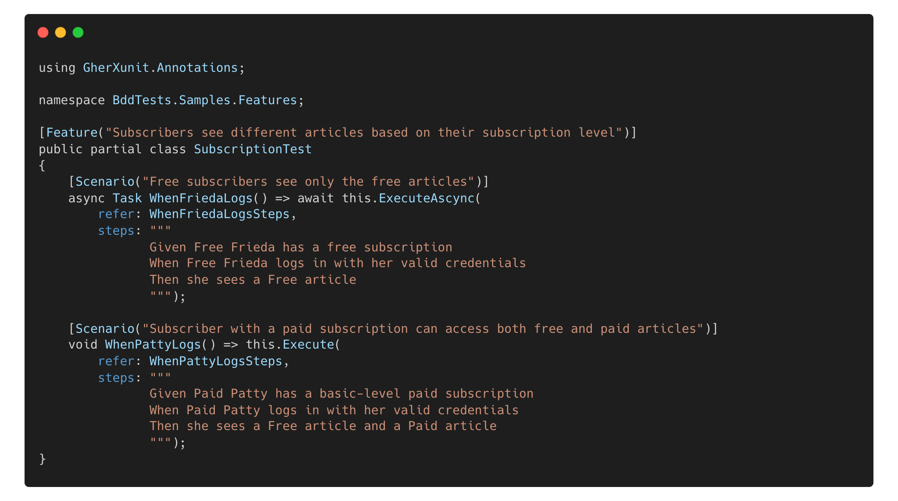
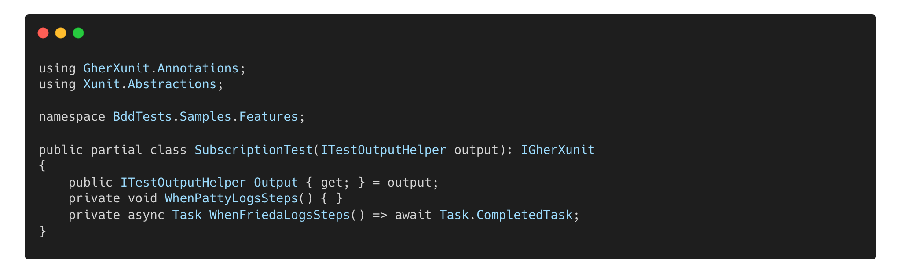

# 🚀 GherXUnit: An Alternative for BDD with xUnit
[🇧🇷 Versão em Português](README_PTBR.md) | [🇬🇧 English Version](README.md)  

The adoption of Behavior-Driven Development (BDD) has become increasingly common in software development, promoting better communication between technical and non-technical teams. However, its integration with traditional testing frameworks is not always straightforward.

> [!IMPORTANT]  
> According to the study *Behavior Driven Development: A Systematic Literature Review* (Farooq et al., 2023, IEEE Access), some recurring difficulties in using BDD include:
> - **Complex automation**: Integration with external tools can increase configuration and test execution complexity.
> - **Difficult maintenance**: As the test base grows, Gherkin scenarios can become hard to manage.
> - **Learning curve**: The need to master new tools can hinder BDD adoption, especially in teams already familiar with traditional frameworks.

**GherXunit** emerges as a viable alternative for teams looking to explore the benefits of BDD within the xUnit framework, without requiring external tools such as Cucumber or SpecFlow. It acts as a superset of xUnit, allowing tests to be written in Gherkin.

### ✅ Where Can GherXunit Help?

**GherXunit** aims to offer an alternative for teams already using xUnit and looking to incorporate the BDD structure without completely changing their tools. Among its benefits are:

- ✔ **Using Gherkin syntax directly in xUnit**, reducing external dependencies.
- ✔ **More modular and organized code**, using partial classes to separate scenarios and steps.
- ✔ **Better integration with unit tests**, allowing a smoother transition between different levels of testing.

### 📦 Getting Started

This package is available through [Nuget Packages](https://www.nuget.org/packages/GherXunit/).

| Version                                                                                        | Downloads | Status |  
|------------------------------------------------------------------------------------------------| ----- |----- |
|  |  |  |

### 💡 How Does It Work?

The core idea of **GherXunit** is to allow test scenarios to be written in a structure familiar to those already using xUnit.
For that, it provides a set of attributes and methods that allow the definition of test scenarios using Gherkin syntax.
The following sections provide examples of how to define test scenarios and implement step methods using **GherXunit**.

#### 📌 Example of Scenario Definition:
The following code snippet shows a test scenario defined using Gherkin syntax in a class named `SubscriptionTest`:

#### 📌 Example of Step Implementation:
The following code snippet shows the implementation of the step methods for the test scenario defined in the `SubscriptionTest` class:

> [!TIP]  
> In this example, the `SubscriptionTest` class is split into two files. The first file defines the test scenarios, while the second file defines the step methods. Using `partial` allows both files to contribute to the definition of the same `SubscriptionTest` class.

#### 📌 Example of output highlighting the test results:
The result of running the test scenarios defined in the `SubscriptionTest` class would be similar to the following output:

  

### 🔎 Is GherXunit for You?
If your team already uses xUnit and wants to experiment with a BDD approach without drastically changing its workflow, **GherXunit** may be an option to consider. It does not eliminate all BDD challenges but seeks to facilitate its adoption in environments where xUnit is already widely used.
See more usage examples and implementation details for `Background`, `Rule`, `Features`, and other elements in the [sample code](/src/sample/BddSample/Samples) available in the **GherXunit** repository.

## 📚 References

- 📖 **Farooq, M. S., et al. (2023). Behavior Driven Development**: *A Systematic Literature Review. IEEE* Access. DOI: [10.1109/ACCESS.2023.3302356](https://doi.org/10.1109/ACCESS.2023.3302356).
- 📖 **North, D. (2006)**. *Introducing BDD. DanNorth.net.* Available at: [https://dannorth.net/introducing-bdd/](https://dannorth.net/introducing-bdd/).
- 📖 **xUnit. (2023)**. *xUnit.net.* Available at: [https://xunit.net/](https://xunit.net/).
- 📖 **Gherkin. (2023)**. *Gherkin.* Available at: [https://cucumber.io/docs/gherkin/](https://cucumber.io/docs/gherkin/).
