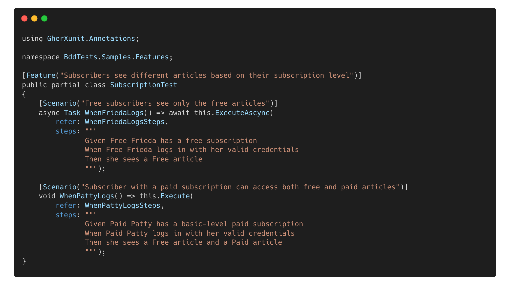
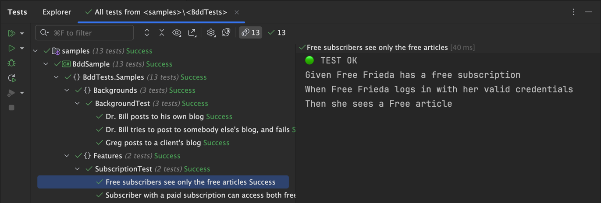

# 🚀 GherXUnit: Uma Alternativa para BDD com xUnit
[🇧🇷 Versão em Português](README_PTBR.md) | [🇬🇧 English Version](README.md)

A adoção do Behavior-Driven Development (BDD) tem se tornado cada vez mais comum no desenvolvimento de software, promovendo melhor comunicação entre times técnicos e não técnicos. No entanto, sua integração com frameworks tradicionais de testes nem sempre é simples.

O **GherXunit** surge como uma alternativa viável para equipes que desejam explorar os benefícios do BDD dentro da estrutura do xUnit, sem precisar de ferramentas externas como Cucumber ou SpecFlow. Ele atua como um superset de xUnit, permitindo a escrita de testes em Gherkin.

> [!IMPORTANT]  
> De acordo com o estudo **“Behavior Driven Development: A Systematic Literature Review” (Farooq et al., 2023, IEEE Access)**, algumas dificuldades recorrentes no uso do BDD incluem
> - **Automação complexa**: A integração com ferramentas externas pode aumentar a complexidade da configuração e execução dos testes.
> - **Manutenção difícil**: À medida que a base de testes cresce, cenários Gherkin podem se tornar difíceis de gerenciar.
> - **Curva de aprendizado**: A necessidade de dominar novas ferramentas pode dificultar a adoção do BDD, especialmente em times já acostumados com frameworks tradicionais.

 

### ✅ Onde o GherXunit Pode Ajudar?

O GherXUnit busca oferecer uma alternativa para equipes que já utilizam xUnit e gostariam de incorporar a estrutura do BDD sem mudar completamente suas ferramentas. Entre os seus benefícios, estão:

- ✔ **Uso da sintaxe Gherkin diretamente no xUnit**, reduzindo dependências externas.
- ✔ **Código mais modular e organizado**, utilizando partial classes para separar cenários e passos.
- ✔ **Maior integração com testes unitários**, permitindo uma transição mais suave entre diferentes níveis de teste.

### 💡 Como funciona?

A ideia central do **GherXunit** é permitir que cenários de testes sejam escritos em uma estrutura familiar para quem já usa xUnit.

####  📌 Exemplo de Definição de Cenário:
O trecho de código a seguir mostra um cenário de teste definido usando a sintaxe Gherkin em uma classe chamada `SubscriptionTest`:

#### 📌 Exemplo de Implementação de Passos:
O trecho de código a seguir mostra a implementação dos métodos de passos para o cenário de teste definido na classe `SubscriptionTest`:

> [!TIP]  
> Neste exemplo, a classe `SubscriptionTest` é dividida em dois arquivos. O primeiro arquivo define os cenários de teste, enquanto o segundo arquivo define os métodos de passos. O uso de `partial` permite que ambos os arquivos contribuam para a definição da mesma classe `SubscriptionTest`.

#### 📌 Exemplo de saída destacando os resultados dos testes:
O resultado da execução dos cenários de teste definidos na classe `SubscriptionTest` seria semelhante à saída a seguir:

  

 

### 🔎 O GherXunit é para você?

Se a sua equipe já usa xUnit e deseja experimentar uma abordagem mais próxima do BDD, sem mudar drasticamente seu fluxo de trabalho, o GherXunit pode ser uma opção a considerar. Ele não elimina todos os desafios do BDD, mas busca facilitar sua adoção em ambientes onde o xUnit já é amplamente utilizado.
Veja mais exemplos de uso e detalhes de implementação de `Background`, `Rule`, `Features` e outros elementos
no [código exemplo](/src/sample/BddSample/Samples) disponível no repositório do GherXUnit.

## 📚 Referências

- 📖 **Farooq, M. S., et al. (2023). Behavior Driven Development**: _A Systematic Literature Review. IEEE_ Access. DOI: [10.1109/ACCESS.2023.3302356](https://doi.org/10.1109/ACCESS.2023.3302356).
- 📖 **North, D. (2006)**. _Introducing BDD. DanNorth.net._ Disponível em: https://dannorth.net/introducing-bdd/.
- 📖 **xUnit. (2023)**. _xUnit.net._ Disponível em: https://xunit.net/.
- 📖 **Gherkin. (2023)**. _Gherkin._ Disponível em: https://cucumber.io/docs/gherkin/.

